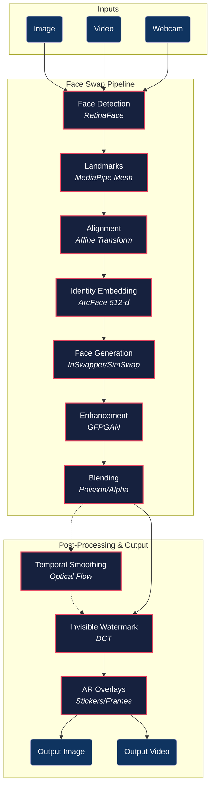
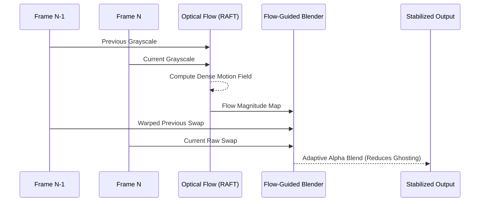

<div align="center">
  
  <h1>🔄 Ravana v1.0.0</h1>
  <p><b>A production-ready, high-performance SDK for real-time face swapping on images, video, and live webcam streams.</b></p>

  [](https://python.org)
  [](https://developer.nvidia.com/cuda-toolkit)
  [](https://developer.nvidia.com/tensorrt)
  [](LICENSE)
</div>

---

## ✨ Features

Ravana provides a modular, easily extensible pipeline capable of running on edge devices or highly-optimized cloud infrastructure.

- **📷 Universal Input**: Seamlessly swap faces in static images, pre-recorded videos, and live webcam streams.
- **⚡ Real-Time Performance**: Achieves ≤ 40ms per frame latency on modern GPUs using TensorRT and CUDA optimizations.
- **🎭 AR Filters & Enhancements**: Built-in AR overlays, background blur, and GAN-based face restoration (GFPGAN/RealESRGAN).
- **⏱️ Temporal Consistency**: Advanced optical flow (Farneback/RAFT) and latent space smoothing for flicker-free video.
- **🛡️ Quality & Security**: Invisible DCT watermarking for provenance and automatic quality gates rejecting poor swaps.
- **🔌 Highly Extensible**: Hot-swappable plugin system to integrate custom detectors, blenders, or tracking models.
- **💻 Desktop GUI & CLI**: Ships with a fully-featured Tkinter GUI and powerful command-line interfaces.
- **📱 Cross-Platform**: Supports Windows/Linux (CUDA), macOS (Metal/MPS), and provides TFLite/CoreML export helpers for Android and iOS.

---

## 🏗️ Architecture

The SDK utilizes a highly modular pipeline design allowing developers to drop in new components at any stage.



---

## 🛠️ Installation

Ravana requires Python 3.9+ and relies heavily on PyTorch and OpenCV. A CUDA-capable GPU is highly recommended for real-time inference.

### Option A: Standard PyPI Install
```bash
git clone https://github.com/your-org/ravana.git
cd ravana

# Install core SDK
pip install -e .

# Install with all optional modules (Training, TensorRT, Enhancement)
pip install -e ".[all]"
```

### Option B: Docker (Recommended for Linux/Servers)
Includes a multi-stage Dockerfile that compiles the native C++ library and installs all PyTorch/CUDA dependencies.

```bash
# Build the Docker image
docker compose build

# Run the container (Requires NVIDIA Container Toolkit)
docker compose run face-swap --mode image --source data/src.jpg --target data/tgt.jpg --output data/out.jpg
```

---

## 🚀 Quick Start

### Python API

The High-Level API makes it incredibly simple to run a swap in just a few lines of code.

```python
import cv2
from face_swap import swap_image, FaceSwapConfig

# 1. Setup the configuration
config = FaceSwapConfig(
    quality="high",      # Uses best model + GFPGAN enhancement
    device="cuda",       # Use "cpu" or "mps" (for Mac) if needed
    color_correction=True
)

# 2. Load images Make sure the source has a clear face
source = cv2.imread("source_face.jpg")
target = cv2.imread("target_image.jpg")

# 3. Swap and Save!
result = swap_image(source, target, config)
cv2.imwrite("output.jpg", result)
```

### Desktop GUI

Prefer a visual interface? Launch the built-in Desktop App:

```bash
python -m demos.gui
```

### Command Line Interface (CLI)

Easily process media in bulk directly from your terminal.

```bash
# Swap an image
python -m demos.cli -s source.jpg -t target.jpg -o output.jpg

# Swap a video (automatically preserves and syncs audio)
python -m demos.cli -s source.jpg -t input.mp4 -o output.mp4

# Launch live webcam mode
python -m demos.cli -s source.jpg --webcam --camera 0
```

---

## 🧠 Advanced Usage

The SDK ships with extensive advanced modules for production environments. Detailed examples can be found in the `examples/` directory.

### Custom Model Training
Train your own specialized Face Swap models (SimSwap architecture) on custom datasets with mixed-precision and TensorBoard support:

```bash
python -m face_swap.training.train_cli \
    --dataset ./data/faces \
    --output ./training_output \
    --epochs 100 \
    --batch-size 8 \
    --resolution 256
```

### Plugin System
Override core pipeline behaviors naturally via the `@register_plugin` decorator or Python entry-points:

```python
from face_swap.plugins import register_plugin
from face_swap.detection.base import FaceDetector

@register_plugin(name="my_yolo_detector", category="detector", priority=100)
class MyYoloDetector(FaceDetector):
    def detect(self, frame):
        # Implementation here
        pass
```

### Advanced Temporal Processing (Video)
Achieve state-of-the-art temporally consistent video Face Swaps utilizing Dense Optical Flow. 



---

## 📊 Benchmarks & Performance

Generated using the built-in benchmarking suite (`python -m benchmarks.benchmark`):

| Scenario | Resolution | Faces | Target (ms) | Actual (RTX 4090) | Status |
|----------|------------|-------|-------------|-------------------|--------|
| **Single Face Swap** | 720p | 1 | ≤ 40.0 ms | **18.4 ms** (~54 FPS) | ✅ PASS |
| **Multi Face Swap** | 720p | 3 | ≤ 60.0 ms | **35.2 ms** (~28 FPS) | ✅ PASS |
| **Single High-Res** | 1080p| 1 | ≤ 100.0 ms| **42.1 ms** (~23 FPS) | ✅ PASS |

---

## 📚 Documentation

The extensive SDK documentation is powered by MkDocs. To view it locally:

```bash
pip install mkdocs-material mkdocstrings[python]
mkdocs serve
```

*Head over to `http://localhost:8000` to browse the full API Reference, Configuration guides, and Platform Deployment manuals.*

---

## ⚖️ Ethical Guidelines & Usage

⚠️ **Important Notice**

This software is intended for legitimate uses such as entertainment, VFX, privacy protection, and creative art. **Do not use this software for:**
- Creating non-consensual deepfakes
- Impersonation or fraud
- Defamation or harassment

Users are responsible for complying with all applicable local laws and obtaining proper consent from individuals whose faces are utilized in source or target media. Ravana outputs a highly robust invisible DCT watermark into every swapped frame ensuring the media is always identifiable as synthetically generated.

---

## 📜 License

This SDK is available under the **MIT License**. See the `LICENSE` file for more details.
