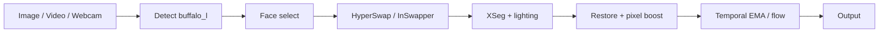

# Ravana

**Python face-swap SDK** for images, video, and webcam — ONNX Runtime on CUDA, AMD DirectML, or CPU.

[](https://python.org)
[](LICENSE)
[](CHANGELOG.md)

```bash
pip install -e ".[directml]"   # AMD Windows
# or: pip install -e ".[gpu]"  # NVIDIA
# or: pip install -e .         # CPU
```

---

## Features (0.3.1)

| Area | What’s included |
|------|-----------------|
| **Quality** | `seamless` preset: HyperSwap-256, GFPGAN (default), XSeg occlusion, lighting/grain match, tiled pixel-boost 1024 |
| **Restores** | GFPGAN · GPEN · CodeFormer · RestoreFormer++ · OpenCV (`--enhance`) |
| **Realtime** | `realtime=True`: detect-every-N, ROI track, skip heavy restore, webcam FPS HUD |
| **Faces** | Select `all` / `largest` / `first` / `index` / `pose` |
| **Metrics** | ArcFace ID + sharpness (`evaluate` / `evaluate-batch` / GUI Score) |
| **Models** | Progress download CLI + presets (`core`, `seamless`, `enhance`, `all`) |
| **Device** | `device="auto"` → CUDA → DirectML → CPU |

---

## Install

```bash
git clone https://github.com/mrigankad/Ravana.git
cd Ravana
python -m venv .venv
# Windows: .\.venv\Scripts\activate
pip install -e .
# GPU extras:
pip install -e ".[gpu]"       # NVIDIA
pip install -e ".[directml]"  # AMD Windows
```

**First run** — prefetch weights (or they download on first swap):

```bash
python scripts/first_run_check.py --download
# same as: python -m demos.cli models download --preset seamless
```

ONNX restores work on Python 3.13 without `basicsr`. Optional `.[enhancement]` PyTorch wheels are not required.

---

## Quick start

### Python

```python
import cv2
from face_swap import FaceSwapConfig, swap_image

config = FaceSwapConfig(
    quality="seamless",
    device="auto",
    # enhance_method="gpen",       # or restoreformer / codeformer / opencv
    # pixel_boost=1024,            # seamless default
    # face_select="largest",
)

out = swap_image(
    cv2.imread("source.jpg"),
    cv2.imread("target.jpg"),
    config,
)
cv2.imwrite("output.jpg", out)
```

### CLI

```bash
# Image
python -m demos.cli -s source.jpg -t target.jpg -o out.jpg -q seamless --device auto

# Restore override
python -m demos.cli -s source.jpg -t target.jpg -o out.jpg -q seamless --enhance gpen

# Video (audio remuxed when ffmpeg is available)
python -m demos.cli -s source.jpg -t input.mp4 -o output.mp4 -q medium

# Webcam (realtime path)
python -m demos.webcam_demo -s source.jpg --device auto --detect-every 3
# keys: q quit | d detect-N | e enhance | h HUD | r reset

# Models
python -m demos.cli models list --presets
python -m demos.cli models download --preset seamless

# Quality metrics
python -m demos.cli evaluate -s source.jpg -t target.jpg -o out.jpg -q seamless
python -m demos.cli evaluate-batch --pairs 2 --enhance gfpgan,gpen --boosts 512
```

### GUI

```bash
python -m demos.gui
```

Quality / device / restore / pixel-boost / face select, plus **Score** on the last output.

---

## Pipeline


```mermaid
flowchart LR
  IN[Image / Video / Webcam] --> DET[Detect buffalo_l]
  DET --> SEL[Face select]
  SEL --> SWP[HyperSwap / InSwapper]
  SWP --> MASK[XSeg + lighting]
  MASK --> ENH[Restore + pixel boost]
  ENH --> TMP[Temporal EMA / flow]
  TMP --> OUT[Output]
```

| Preset | Behavior |
|--------|----------|
| `seamless` | HyperSwap + GFPGAN + XSeg + lighting + boost 1024 + video temporal |
| `high` / `medium` | InSwapper + lighter restore |
| `fast_cpu` / `low` | Speed path, enhance off |
| `realtime=True` | Any quality + detect-every-N + ROI + skip heavy restore (webcam) |

---

## Docs & tests

```bash
# Unit tests
python -m pytest tests/ -q

# MkDocs (optional)
pip install mkdocs-material mkdocstrings[python]
mkdocs serve
```

- Getting started: [docs/getting-started/quickstart.md](docs/getting-started/quickstart.md)
- Changelog: [CHANGELOG.md](CHANGELOG.md)

---

## Ethical use

For entertainment, VFX, privacy, and creative work **with consent**. Do not use for non-consensual deepfakes, impersonation, or fraud. You are responsible for complying with local law. Optional invisible DCT watermarking is available for provenance.

Third-party model licenses (InsightFace, FaceFusion HyperSwap ResearchRAIL, GFPGAN/GPEN/etc.) apply to downloaded weights — review those before commercial use.

---

## License

MIT — see [LICENSE](LICENSE).
